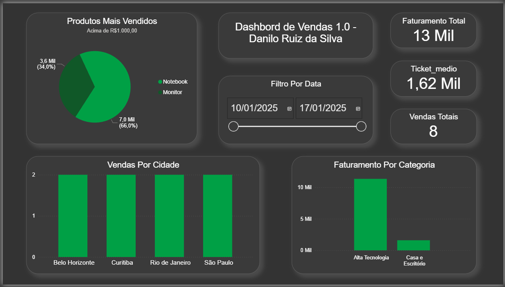

# Analise-vendas-sql-powerbi
Projeto de análise de vendas utilizando SQL no MySQL Workbench e Power BI.

Desenvolvido com o intuito de praticar análise de dados atraves da criação de meu primeiro projeto, utilizando SQL, MySQL Workbench e Power BI.

## Tecnologias Utilizadas
- SQL no MySQL Workbench
  - INNER JOIN
  - CASE WHEN
  - GROUP BY

- Power BI
  - Criação do Dashboard
  - Criação de medidas DAX

## Objetivos
- Criar consultas SQL para análise de vendas
- Construir uma tabela final para análise
- Desenvolver um dashboard interativo
- Criar indicadores de negócio

## KPIs
- Faturamento Total
- Ticket Médio
- Quantidade de Vendas
- Faturamento por Categoria

## Imagem do Dashboard

## Aprendizados
- Relacionamento entre tabelas
- Criação de métricas analíticas
- Construção da tabela final
- Integração SQL + Power BI
- Criação de medidas DAX
